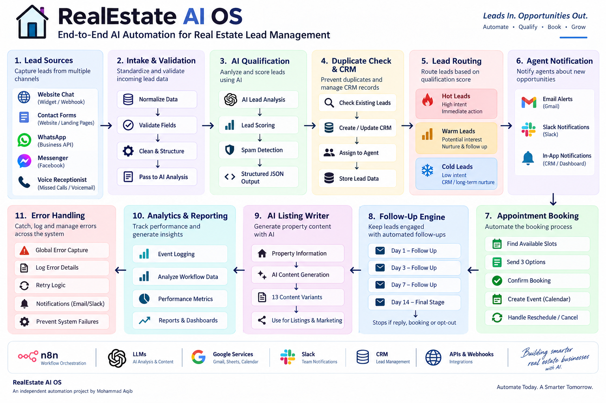

# RealEstate AI OS

### AI-Powered Real Estate Lead Lifecycle Automation

An end-to-end **n8n automation system** designed to manage the real estate lead lifecycle — from multi-channel lead intake and AI qualification to CRM management, routing, appointment booking, follow-ups, listing content generation, analytics, and error handling.



---

## Overview

Real estate businesses receive leads from multiple channels, but the information often arrives fragmented across forms, chat, messaging platforms, and calls.

RealEstate AI OS creates a unified automation layer that processes these leads through a structured lifecycle.

### Core Flow

```text
Lead Sources
     ↓
Multi-Channel Intake
     ↓
Data Normalization
     ↓
AI Qualification
     ↓
Spam Detection
     ↓
Duplicate Detection
     ↓
CRM Update
     ↓
Lead Routing
     ↓
Agent Notification
     ↓
Appointment Booking
     ↓
Follow-Up Automation
     ↓
Analytics & Reporting
# RealEstate AI OS

### AI-Powered Real Estate Lead Lifecycle Automation

An end-to-end **n8n automation system** designed to manage the real estate lead lifecycle — from multi-channel lead intake and AI qualification to CRM management, routing, appointment booking, follow-ups, listing content generation, analytics, and error handling.


---

## Overview

Real estate businesses receive leads from multiple channels, but the information often arrives fragmented across forms, chat, messaging platforms, and calls.

RealEstate AI OS creates a unified automation layer that processes these leads through a structured lifecycle.

### Core Flow

```text
Lead Sources
     ↓
Multi-Channel Intake
     ↓
Data Normalization
     ↓
AI Qualification
     ↓
Spam Detection
     ↓
Duplicate Detection
     ↓
CRM Update
     ↓
Lead Routing
     ↓
Agent Notification
     ↓
Appointment Booking
     ↓
Follow-Up Automation
     ↓
Analytics & Reporting

The system is designed around a combination of:

AI decision-making
Deterministic business logic
API integrations
Webhooks
CRM operations
Automated communication
Scheduling
Error handling
The Problem

Real estate teams can lose opportunities when:

Leads arrive through different channels
Lead information is inconsistent
Agents manually qualify every inquiry
High-value leads are not identified quickly
Duplicate leads enter the CRM
Follow-ups are forgotten
Appointment scheduling requires back-and-forth communication
Missed calls are not recovered
Lead activity is difficult to track

RealEstate AI OS addresses these problems by connecting the major stages of the lead lifecycle into one automation architecture.

Solution

The system receives lead information from multiple sources, converts it into a standardized structure, analyzes the lead using AI, applies deterministic business rules, updates the CRM, routes the lead to the appropriate workflow, and continues the lifecycle automatically.

The architecture is modular so individual components can be adapted or replaced without rebuilding the entire system.

Architecture
High-Level Architecture
                         ┌─────────────────────┐
                         │    Lead Sources     │
                         │                     │
                         │ Website Chat        │
                         │ Contact Form        │
                         │ WhatsApp             │
                         │ Messenger            │
                         │ Voice Receptionist   │
                         └──────────┬──────────┘
                                    │
                                    ▼
                         ┌─────────────────────┐
                         │   Intake Layer      │
                         │                     │
                         │ Validation          │
                         │ Normalization       │
                         │ Unified Lead Schema  │
                         └──────────┬──────────┘
                                    │
                                    ▼
                         ┌─────────────────────┐
                         │   AI Qualification  │
                         │                     │
                         │ Intent              │
                         │ Urgency             │
                         │ Sentiment            │
                         │ Lead Score           │
                         └──────────┬──────────┘
                                    │
                                    ▼
                         ┌─────────────────────┐
                         │   Lead Protection   │
                         │                     │
                         │ Spam Detection      │
                         │ Duplicate Detection │
                         └──────────┬──────────┘
                                    │
                                    ▼
                         ┌─────────────────────┐
                         │    CRM Layer        │
                         │                     │
                         │ Lead Record         │
                         │ Status              │
                         │ Assignment           │
                         │ Follow-up State     │
                         └──────────┬──────────┘
                                    │
                    ┌───────────────┼───────────────┐
                    ▼               ▼               ▼
                 HOT             WARM            COLD
                    │               │               │
                    ▼               ▼               ▼
              Agent Alert       Follow-Up       Nurturing
                    │
                    ▼
            Appointment Booking
                    │
                    ▼
             Calendar Event
                    │
                    ▼
             Lead Lifecycle
                    │
                    ▼
          Analytics & Event Logs

For the visual implementation, see:

Architecture Diagram

Core Modules
1. Multi-Channel Intake

Accepts leads from different entry points and converts incoming information into a consistent lead structure.

Supported channel architecture includes:

Website chat
Contact forms
WhatsApp
Messenger
Voice receptionist
2. AI Lead Qualification

The AI analyzes incoming lead information and extracts structured qualification data.

Example fields include:

Intent
Property Type
Suburb
Budget
Bedrooms
Bathrooms
Timeline
Finance Status
Sentiment
Urgency
Confidence
Lead Score

The workflow uses structured AI output rather than relying entirely on free-form responses.

3. Spam Detection

Incoming leads can be evaluated for spam probability before entering the main lead-processing lifecycle.

This provides an additional filtering layer before downstream automation.

4. Duplicate Detection & CRM

The system checks incoming information against existing lead records using multiple identifying fields.

When appropriate, the CRM record can be updated rather than creating another duplicate entry.

5. Agent Assignment

Qualified leads can be routed to an appropriate agent based on the configured business logic.

This creates a bridge between automated qualification and human sales activity.

6. Lead Routing & Notifications

Leads are categorized into:

HOT
WARM
COLD

Hot leads can trigger immediate internal notifications through configured communication channels.

7. Appointment Booking

The booking system can:

Identify available appointment slots
Offer available options
Wait for customer confirmation
Create the calendar event
Update the lead record

Rescheduling and cancellation flows are also supported by the architecture.

8. Missed Call Recovery

The system includes a recovery path for missed calls so that potential opportunities do not simply disappear after an unanswered call.

9. Follow-Up Sequence Engine

The system can scan lead records and determine when another follow-up is required.

The documented sequence includes:

Day 1
Day 3
Day 7
Day 14

Follow-up activity can stop when a lead:

Replies
Books an appointment
Opts out
Reaches another configured stopping condition
10. AI Follow-Up Generation

AI can be used to generate context-aware follow-up communication based on the lead's available information and lifecycle state.

11. AI Listing Writer

The system includes an AI-powered property content generation module.

The documented implementation generates:

13 content variants per property

This allows property information to be transformed into multiple marketing-oriented content formats.

12. Analytics & Event Logging

Important workflow events can be recorded throughout the lead lifecycle.

Example events:

lead_received
lead_qualified
lead_rejected
lead_routed
agent_notified
followup_sent
appointment_requested
appointment_booked
appointment_cancelled
lead_replied
lead_opted_out
workflow_error

Scheduled summaries can then be generated from the collected event data.

13. Global Error Handling

A centralized error-handling architecture is included to capture failures from different parts of the system.

Potential failure points include:

API requests
AI responses
Invalid input
CRM operations
Email delivery
Calendar operations
Messaging integrations
Authentication failures

The goal is to prevent individual workflow failures from becoming invisible.

AI Architecture

AI is used where probabilistic reasoning provides value.

Examples:

Lead qualification
Intent extraction
Sentiment analysis
Urgency detection
Lead scoring
Follow-up generation
Property listing content generation

Deterministic logic remains responsible for operations that should behave predictably.

Examples:

Validation
Routing
Duplicate checks
State management
CRM updates
Scheduling operations
Error handling

This creates a hybrid architecture:

             AI
              │
     ┌────────┴────────┐
     │                 │
Reasoning         Structured Output
     │                 │
     └────────┬────────┘
              ▼
       Deterministic Logic
              │
     ┌────────┼────────┐
     ▼        ▼        ▼
    CRM    Routing   Actions
Technology Stack
Technology	Purpose
n8n	Workflow orchestration
Google Gemini	AI qualification and generation
Google Sheets	CRM-style data storage
Gmail	Email communication
Google Calendar	Appointment scheduling
Slack	Internal notifications
Twilio	Communication and missed-call workflows
Webhooks	Multi-channel event ingestion
APIs	External service integration
Reliability & Workflow Design

The architecture focuses on making automation predictable and maintainable.

Key principles include:

Input validation
Structured AI responses
Deterministic routing
Duplicate protection
Error handling
Modular workflow design
State tracking
External service separation
Credential isolation

AI is not treated as the sole source of truth for every operation.

Instead, AI output is passed into deterministic workflow logic before important downstream actions occur.

Repository Structure
realestate-ai-os/
│
├── architecture/
│   └── overview.png
│
├── docs/
│   ├── architecture.md
│   ├── modules.md
│   └── setup.md
│
├── examples/
│   ├── sample-input.json
│   └── sample-output.json
│
├── workflows/
│   └── realestate-ai-os-sanitized.json
│
└── README.md
Documentation
Technical Architecture

Detailed explanation of the system architecture:

docs/architecture.md

Module Documentation

Detailed breakdown of the individual automation modules:

docs/modules.md

Setup Guide

Import, credential configuration, deployment, security, and configuration instructions:

docs/setup.md

Workflow

Sanitized n8n workflow:

realestate-ai-os-sanitized.json

Examples

Example input and structured output:

examples/

Example
Input
{
  "name": "Sarah Mitchell",
  "email": "sarah@example.com",
  "source": "website_chat",
  "message": "I'm looking to buy a 3 bedroom house in Parramatta with a budget around AUD 900,000.",
  "property_type": "house",
  "suburb": "Parramatta",
  "budget": "AUD 900,000",
  "timeline": "within 2 months"
}
Processing
Incoming Lead
     ↓
Normalize
     ↓
Validate
     ↓
AI Qualification
     ↓
Spam Check
     ↓
Duplicate Check
     ↓
CRM
     ↓
Lead Score
     ↓
Routing
Example Result
Lead Score: 86
Lead Tier: HOT
Intent: Buyer
Urgency: High
Confidence: 94%

Next Action:
Offer inspection slots

The complete example is available in the examples/ directory.

Security

This repository contains a sanitized workflow.

Production credentials, API keys, tokens, customer information, and private CRM data should never be committed to GitHub.

Credentials should be configured through n8n's credential management system.

Example data in this repository is fictional.

Project Status

Status: Portfolio / Independent Engineering Project

This project demonstrates the design and implementation of a production-oriented AI automation architecture using n8n.

It is presented as an independent project and is not represented as client work.

What This Project Demonstrates

This project demonstrates practical experience with:

AI automation architecture
n8n workflow engineering
LLM integration
Structured AI outputs
API integrations
Webhook architecture
CRM automation
Lead qualification
Business process automation
Appointment scheduling
Automated follow-ups
Notification systems
Analytics
Error handling
Workflow security
Modular system design
Developer

Mohammad Aqib

AI Automation Developer focused on building AI-powered workflows, agents, and business automation systems.

Core focus:

n8n
AI Agents
LLMs
APIs
Webhooks
CRM Automation
Business Process Automation
